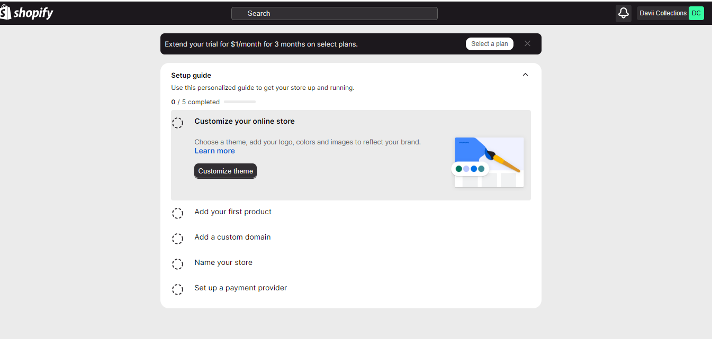
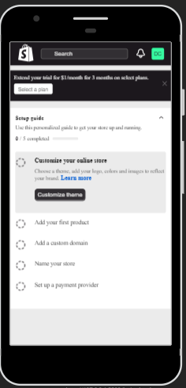

# This is a projects that was developed upon just HTML, CSS, and Vanila Javascript to build an accesible and responsive shopify theme.

## The challenge

The challenge from Franz Kati of [crushing it tech](https://www.crushingit.tech/hackathon/challenge) here is to build a merchant onboarding experience to carter for the three of the most popular types of Shopify merchants:

+ Mouse users
+ Screen readers 
+ keyboard users

### What I learnt
I lernt more about the different **ARIA** html attributes, and semantic HTML tags available with which one can build accessible webpages with, to carter for the different categories of web users out there regardless of their limitations.

Example of these attributes are as follows:
```
aria-hashpopup;
aria-expanded;
aria-controls;
aria-label;
aria-controlledby;
role;
tabindex;
```
and a whole lot more that can be found [here](https://developer.mozilla.org/en-US/docs/Accessibility/ARIA/Atrributes)




